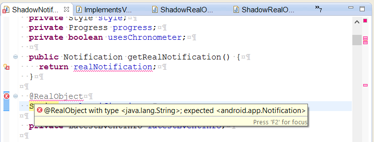

# Robolectric Annotation Processor (RAP)

Welcome to the Robolectric Annotation Processor project.

## What is the Robolectric Annotation Processor?

The Robolectric Annotation Processor (RAP) is an annotation processor that uses Java's built-in annotation processing capability (introduced in Java 6) to make Robolectric development easier. It does this in two ways:

1. It can automatically generate some parts of the code based on the annotations on the shadows.
2. It enforces at compile-time some constraints that are implied by Robolectric annotations, to help keep code clean and avoid silly bugs.
3. It improves performance by doing some things at compile time that previously had to be done at load time or run time.

These are discussed in more detail below.

### Automatic code generation

Robolectric has a large amount of boilerplate code in the form of the <code>shadowOf()</code> methods that form a convenient type-safe wrapper around the <code>shadowOf_()</code> base method. This is boilerplate code that must be kept in sync with the actual state of the shadows and imposes extra maintenance overhead. RAP can generate these methods automatically using the information contained in the annotations on the shadows.

### Constraint enforcement

There are a number of usages and constraints implicit in Robolectric's annotation model which if violated will introduce bugs. Many of these cannot be expressed using the simple type system in the annotations themselves. Testing for violations of these constraints at present is enforced by unit tests such as `RobolectricWiringTest`.

RAP employs the philosophy that the earlier in the development cycle you can perform these tests, the better. RAP allows detection of constraint violations at *compile time* rather than during unit testing, which helps to further shorten the development cycle.

Constraints currently enforced by RAP are:

* <code>@Resetter</code> on a method that is not public static void with no parameters.
* <code>@RealObject</code> or <code>@Resetter</code> on a class not annotated by <code>@Implements</code>
* <code>@RealObject</code> annotated field with a type that is not assignment compatible with the implemented class.
* <code>@Implements</code> specifying an unknown class.

Eventually it should be possible to migrate all of the relevant unit tests (such as `RobolectricWiringTest`) to RAP so that all the relevant constraints are enforced by the compiler.

#### In-editor error feedback

As an added bonus over constraint enforcement during unit testing, when RAP reports an constraint violation to its tooling environment, the tooling environment will give feedback on where in the source the error is. In Eclipse (and presumably other modern IDEs like IntelliJ), errors detected by RAP will be reported in the editor with the standard error markers, and mouse-overing them will tell you what the error is. This typically happens immediately when you save a document.

### Better runtime performance

One of the benefits of RAP is that it enables things to be done at compile time instead of runtime. For example, there are two ways that global reset can be implemented:

1. by implementing a method that statically calls all of the known reset methods on all shadows, or
2. by iterating over all shadows at runtime looking for reset methods.

The first is more efficient at runtime but imposes an extra maintenance burden, because the developer needs to remember to add calls to reset methods here when they add new resets. The second is requires less maintenance, but imposes an extra runtime overhead.

RAP allows you to have the best of both worlds - it will automatically find all reset methods and generate a global <code>reset()</code> method that statically invokes them all. Because <code>reset()</code> is called for each and every individual test, improvements in its performance can make a noticeable difference to a fixture's performance.

There are likely other opportunities for this sort of optimization in Robolectric using RAP, which could be the subject of a future expansion.

## How to use RAP

In this early stage, RAP is mostly targeted at those contributing to Robolectric itself. Those who wish to do so will simply need to check out the relevant branch of the Robolectric repository, which will already have the <code>pom.xml</code> file configured appropriately.

However, with some few modifications some of the features (such as the constraint enforcement, or custom <code>shadowOf()</code>/global <code>reset()</code> methods) could also be of benefit to users of Robolectric who are developing their own custom shadows. This feature may be added in a future version

## Future enhancements

In developing RAP I forsaw a number of enhancements that would be potentially useful:

* Some of the features in this list have not yet been added due to limitations in the testing framework - if I haven't been able to fully test a feature I haven't added it. Hopefully improvements in the compile-testing library will rectify this situation in the near future.
* Ability to use RAP outside of the context of developing the Robolectric core, to be able to validate your own shadows.
* Validation of <code>@Implementation</code>-annotated methods to make sure that their method signatures matched appropriately (similar to the <code>@Overrides</code> annotation). I know personally that mismatching method signatures in shadows has caused me grief in the past and the error reporting for such conditions is not all that obvious. I think that this feature could help many Robolectric developers working on core or custom shadow implementations.
* Warn when the type of a <code>@RealObject</code> is not the narrowest available type.
* Better handling of shadows of generic types. At present the checking of appropriate generic types is limited and there is a lot more that could be done to help the developer. Also, the auto-generated <code>shadowOf()</code> methods do not include the type parameters which can lead to "unchecked" warnings in client code.
* Generally speaking, there is probably a lot more which Robolectric currently does at initialization/run time that could conceivably be pre-computed at compile time using RAP or something similar, to improve runtime performance.

## Credits

A special thanks to the Robolectric team (both its original authors and current maintainers) for producing such a useful tool for test-driven Android development.

### About the author

I started my professional career as a software engineer, and more recently was ordained an Orthodox Christian priest. For now I still works as a software engineer while assisting at my parish in a part-time capacity. I try to employ my engineering experience in ways that might assist my parish (the [Holy Monastery of St Nectarios, Adelaide](http://www.stnectarios.org.au/)).

## Licensing & Donating

Like Robolectric itself, RAP is free software distributed under the MIT license.

However, as a priest I feel that everything I do must be in service of my ministry, and so I also developed RAP partially in the hope that appreciative users might find it in their hearts to make a financial contribution to our parish as an expression of their appreciation. Please visit our website for details: the [Holy Monastery of St Nectarios, Adelaide](http://www.stnectarios.org.au).
