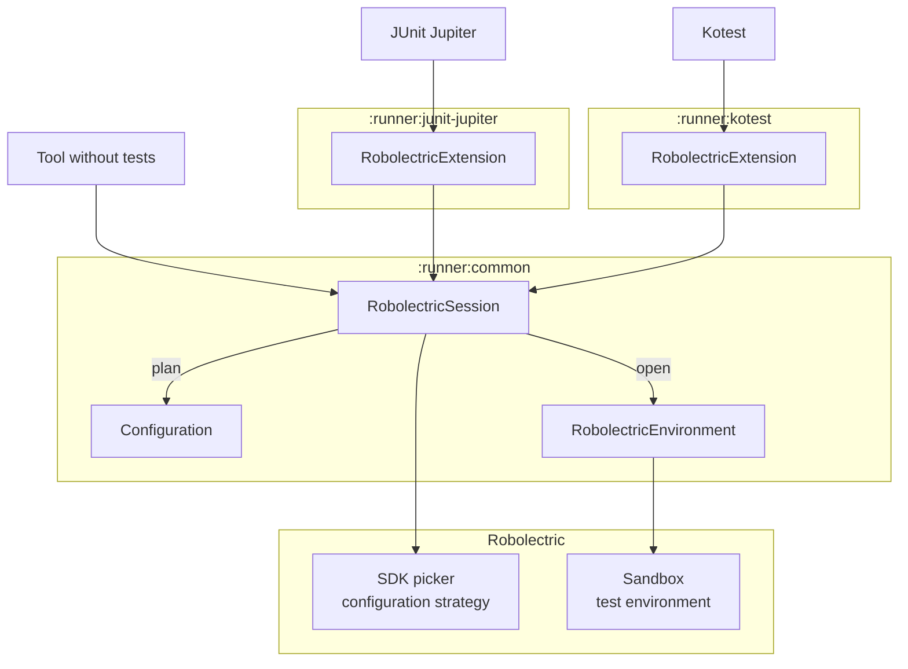
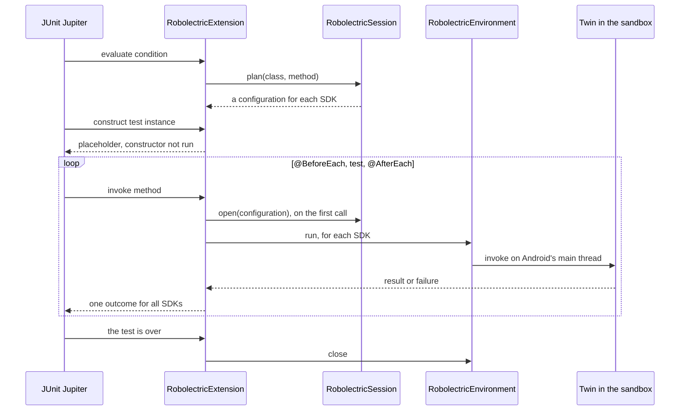

# Robolectric runners

Experimental modules that run Robolectric without the JUnit 4 `RobolectricTestRunner`, which they
leave untouched.

| Module | Artifact | Purpose |
| ------ | -------- | ------- |
| `:runner:junit-jupiter` | `runner-junit-jupiter` | `RobolectricExtension`, which runs JUnit Jupiter tests in Robolectric. |
| `:runner:kotest` | `runner-kotest` | `RobolectricExtension`, which runs Kotest specs in Robolectric. |
| `:runner:kotest-gradle-plugin` | plugin `org.robolectric.kotest` | Lets the static initializers of spec classes use Android in the tasks of Kotest's own Gradle plugin. |
| `:runner:common` | `runner-common` | The API that integrations with test frameworks build on, and that tools use which need Android without a test framework. |

## JUnit Jupiter

```kotlin
@ExtendWith(RobolectricExtension::class)
@Config(sdk = [33, 34])
class MyTest {
  private val context = ApplicationProvider.getApplicationContext<Context>()

  @Test
  fun usesAndroid() { // runs on both SDKs, as one test
    assertThat(context.packageName).isNotEmpty()
  }

  @RobolectricSdkTest
  fun reportsEachSdk() { // runs on both SDKs, as reportsEachSdk[33] and reportsEachSdk
    assertThat(Build.VERSION.SDK_INT).isAnyOf(33, 34)
  }
}
```

Tests are configured as with `RobolectricTestRunner`. A `@Nested` class is configured like the
class that encloses it, unless it is configured itself.

- **SDKs.** A test runs on every SDK that its configuration and `robolectric.enabledSdks` select.
  A `@Test` reports them as one test: it fails if it fails on any SDK, and says on which, and an
  assumption that fails on one SDK only skips the rest of the test there. A test that no SDK is
  selected for is skipped, with the reason.
- **`@RobolectricSdkTest`** reports each SDK as a test of its own. It replaces `@Test` on a test,
  or goes on a class, which then runs once for each SDK, as `SDK 33` and `SDK 34`, with the tests
  that are configured for that SDK.
- **Android state** is per test. A class with `@BeforeAll` or `@AfterAll` methods, or with
  `@TestInstance(PER_CLASS)`, has one environment for each SDK for all its tests. A test that is
  configured differently than the class then fails, unless it is a `@RobolectricSdkTest`, which
  gets an environment of its own.
- **Parallel execution** follows `junit.jupiter.execution.parallel.enabled`: tests that run at the
  same time have a sandbox each, unless they share the environment of their class.
- **Parameters.** Constructors, test methods and lifecycle methods can take the `Context`, the
  `Application`, an `ActivityController` or a `ServiceController`.
- **As with the runner**, an application that implements `TestLifecycleApplication` is told about
  each test, and a failure carries Robolectric's hints, such as tasks that the test left
  unexecuted on the main looper.

JUnit's own features work as JUnit defines them: inheritance, `@Nested`, `@ParameterizedTest`,
`@RepeatedTest`, `@TestFactory`, `@Timeout`, `@TestInstance`, `@TempDir`, constructor parameters,
assumptions and conditions. What doesn't is listed under [Limits](#limits).

## Kotest

```kotlin
@ApplyExtension(RobolectricExtension::class)
@Config(sdk = [33, 34])
class MySpec : FunSpec({
  val context = ApplicationProvider.getApplicationContext<Context>()

  test("uses Android") { // runs on both SDKs, as uses Android[33] and uses Android
    context.packageName.shouldNotBeEmpty()
  }
})
```

A spec is configured as a test class is with `RobolectricTestRunner`.

- **The spec is created in the sandbox**, so its body, its callbacks and its tests can all use
  Android, and run on Android's main thread. So can the static initializers of its class, such as
  that of a companion object. It has to be a class with a constructor without parameters.
- **SDKs.** A spec runs on every SDK that its configuration and `robolectric.enabledSdks` select.
  On several SDKs, the spec is created once for each of them, and each of its root tests is
  reported once for each SDK, marked as the test runner marks tests: `uses Android[33]`, and
  `uses Android` on the last SDK. A test that fails on one SDK fails there only. If no SDK is
  selected, the spec is skipped: it has one ignored test, whose name says why.
- **Android state** lives as long as the spec instance. With Kotest's default isolation mode, the
  tests of a spec that run on the same SDK share one instance, and so its Android state. With
  `IsolationMode.InstancePerRoot`, each root test has an instance and an environment of its own.
- **Coroutines.** A test can suspend, and is back on the main thread afterwards, also if Kotest
  runs tests on a dispatcher of their own. It can launch coroutines in its own scope, and use
  Kotest's virtual time. `Dispatchers.Main` is Android's main dispatcher for the environment of the
  test, unless the test sets one with `Dispatchers.setMain`.
- **As with the runner**, a failure carries Robolectric's hints.

A spec class can also implement `RobolectricSpec`, which applies the extension as the annotation
does: `class MySpec : FunSpec({ ... }), RobolectricSpec`. With Kotest's own launcher, that is what
lets the static initializers of spec classes use Android, see [Limits](#limits).

## Architecture



- **`:runner:common` is the only module that uses Robolectric's internals.** It plans and opens
  environments the way `RobolectricTestRunner` runs a test: the SDK picker and the configuration
  strategy decide where a test runs, a sandbox is configured as the runner configures it, and the
  test environment sets up and resets the application. Its API has none of those types, so they
  can change without breaking integrations.
- **The integrations use only that API**, in two different ways, which is what validates it. The
  Jupiter extension gives JUnit a placeholder and redirects each call to a twin in the sandbox.
  The Kotest extension creates the spec in the sandbox, and gives Kotest a stand-in that has its
  tests and passes callbacks on to it.
- **No silent fallbacks.** A test that can't run as it is configured is skipped or fails with a
  message that says what to change. It never runs on another SDK or with another configuration.

### The API of `:runner:common`

```kotlin
RobolectricSession.create().use { session ->
  val configurations = session.plan(testClass, testMethod) // one for each SDK, no sandbox yet
  session.open(configurations.first()).use { environment -> // sets up Android; closing tears it down
    val twin = environment.loadClass(testClass) // the test class as the sandbox loads it
    environment.run { /* on Android's main thread: create the twin, call its methods */ }
  }
}
```

| Type | Role |
| ---- | ---- |
| `RobolectricSession` | Lives for a test run. `plan` returns a configuration for each SDK that Robolectric selects for a test, without creating a sandbox, so it can be used during test discovery. `open` sets up Android for one of them. |
| `Configuration` | Robolectric's own type for the configuration of a test: its `Config` and its modes. In one that `plan` returns, the `Config` has the SDK of the environment as its only one: `get(Config::class.java).sdk`. Two are equal if their environments are interchangeable, which tells whether a test can run in an environment that is already open. A tool without tests, such as a REPL or a preview renderer, plans from a `Config` that it builds: `session.plan(Config.Builder().setSdk(34).build())`. `robolectric.enabledSdks` doesn't apply to that. |
| `RobolectricEnvironment` | Android set up in a sandbox. `run` runs code on Android's main thread, `loadClass` returns a class as the sandbox loads it, `diagnoseFailure` adds Robolectric's hints to the failure of a test, and `close` tears Android down. |
| `RobolectricSession.Builder` | Sets the properties to use instead of the system properties, the packages that sandboxes share with the test framework rather than load again, and a `RobolectricSessionListener`, which is told when environments open and close, and how long that took. |

- **How long an environment stays open decides what shares Android state.** Open one for each
  test to isolate tests, or keep one open for a class to share state.
- **Every open environment has a sandbox to itself**, from a pool that reuses the sandboxes of
  closed environments, so a session can be used from several threads.
- **Environments are set up and torn down one at a time**, because that touches state of the whole
  JVM, such as security providers. What runs in them runs in parallel.
- **A session doesn't need JUnit 4.** Robolectric's default global configuration comes from a
  class of `RobolectricTestRunner`, so the session provides that default itself.

The API is marked `@ExperimentalRunnerApi`, and everything else in the modules is internal.

### How the Jupiter extension runs a test



JUnit loads the test class itself, outside of the sandbox, where there is no Android. The
extension therefore gives JUnit a **placeholder** for the test instance, whose constructor and
field initializers don't run, and redirects every call that JUnit makes on it to a **twin**: an
instance of the same class as the sandbox loads it, constructed with the arguments that JUnit
resolved. What JUnit or another extension injects into the placeholder, such as a `@TempDir`
field, is copied into the twin.

- **JUnit drives the lifecycle.** The extension doesn't find or order lifecycle methods itself, so
  inheritance, `@Nested` classes, ordering, failures in `@AfterEach` methods, assumptions and
  conditions behave as JUnit defines them.
- **Environments live in JUnit's stores**, which close them when the test is over. A class that
  shares Android state has its environments opened before its `@BeforeAll` methods and closed
  after its `@AfterAll` methods instead.
- **Why not one instance?** JUnit could load the test classes with the sandbox's class loader,
  from a `LauncherInterceptor`. That was tried: Gradle loads the test classes itself and hands
  them to the launcher, and one class loader for a run would mean one SDK and one configuration
  for all its tests.

### How the Kotest extension runs a spec

Kotest lets an extension create a spec. The extension opens an environment for each SDK, and
creates the spec in each, from its class as the sandbox loads it. Kotest runs the tests of the one
spec that it gets, and its own reporters know a spec by its class, so what Kotest gets is a
**stand-in**: a spec of the class that Kotest discovered, whose constructor didn't run. It has the
root tests of the instances in the sandbox, and is configured as they are.

- **Callbacks run for the instance.** Kotest tells the callbacks of a spec about the stand-in and
  its tests. The stand-in passes that on to the callbacks of the instance that a test comes from,
  as a test of that instance: the callbacks that a spec registers in its body only run for tests
  of a spec of their own class.
- **The spec runs in an event loop on Android's main thread.** The extension starts the loop
  around the spec, with its callbacks and tests, and dispatches a test back to it if Kotest moved
  the test to another dispatcher.
- **Kotest and the spec share `kotlinx.coroutines`.** The sandbox uses its classes as Kotest
  loaded them, apart from those for a platform, such as `kotlinx.coroutines.android`, so the scope
  of a test, which Kotest creates, is a coroutine scope for the code of the test too.
  `Dispatchers.Main` then is one for the JVM, so before something of a spec runs, the extension
  sets it to Android's main dispatcher of the environment that it runs in.
- **An environment is closed when the spec that Kotest got is done.** Kotest's isolation mode
  decides how many specs it asks for, and so which tests share Android state.
- **One session serves all specs of a run.** It is closed when Kotest's project is over.
- **Kotest initializes a spec class when it discovers it**, outside of the sandbox, where a static
  initializer that uses Android fails, and with it the discovery of all specs. So before something
  loads a spec class, the module defines it for Kotest with a static initializer that keeps its
  failure for the constructors of the class, which the extension doesn't use. It does so when the
  JUnit Platform opens its launcher session, for the classes in the directories of the class
  path, and when a discovery starts, for the classes that it selects. The sandbox loads the class
  as it is, and initializes it in Android. Where nothing can be hooked into before a spec class
  is loaded, the module does the same as a Java agent, to the classes as the JVM loads them, or
  as a step of the build, which writes the spec classes guarded into a directory that goes before
  the class path.
  The Gradle plugin `org.robolectric.kotest` adds that step to the tasks of Kotest's own plugin.
- **`RobolectricSpec` gives the module its turn with Kotest's own launcher**, which initializes
  the spec classes first of all. The JVM initializes the interface with the first spec class that
  implements it, before the static initializer of that class runs. The module guards the spec
  classes that are not loaded yet there. The class that is being initialized can't be guarded any
  more, so if it has a static initializer, the module runs Kotest's launcher again, from where it
  is: for that run the class counts as initialized on the thread of the launcher, and its static
  initializer never runs outside of the sandbox.

## Limits

With JUnit Jupiter, JUnit itself works outside of the sandbox, and knows a `@Test` as one test:

- **Objects that JUnit passes to the twin**, as arguments or into fields, are passed as they are
  if the sandbox shares their class, as it does for those of the JDK and of JUnit. Others, such as
  objects of the test's own classes from a `@MethodSource`, are recreated in the sandbox, so they
  have to be enum constants or serializable.
- **Other extensions** see the classes as JUnit loads them. What they set up in a class that the
  sandbox loads again, such as a dispatcher of `kotlinx.coroutines`, doesn't reach the test. Set
  that up in a lifecycle method, which a test class can inherit.
- **Static initializers of a test class** run when JUnit creates its instance, so they can't use
  Android. A `@BeforeAll` method can.
- **A class with a `@RegisterExtension` field that isn't static** is constructed by JUnit, which
  takes the extension from the instance. Its constructor and field initializers can't use Android,
  and its constructor can't have Android parameters. Register the extension from a static field.
- **A `@Test` on several SDKs** is seen once by other extensions and by its time limit.
  `@RobolectricSdkTest` makes each SDK a test of its own.

With Kotest, the spec is in the sandbox, but Kotest is not:

- **A spec class that overrides callback functions of Kotest's `Spec`**, such as `beforeTest`, or
  its `extensions`, can't have a stand-in of its own class: Kotest would call them outside of the
  sandbox. Such a spec runs, with a stand-in of another class, but Kotest's own reporters, which
  know a spec by its class, don't recognize it. That includes the TeamCity reporter that Kotest's
  IntelliJ plugin reads. Kotest's runner for the JUnit Platform, which Gradle uses, reports by
  name. Register callbacks in the body of the spec to avoid this.
- **A spec that is an `object`** is created by Kotest itself, outside of the sandbox. It fails,
  and says so: make it a class. If its body uses Android, it fails where Kotest creates it, which
  is when it discovers the specs, and their discovery with it.
- **Static initializers of a spec class** can use Android with Kotest's runner for the JUnit
  Platform, which is how Kotest runs specs on the JVM by default, with Gradle's `test` task: the
  module hooks into its launcher session. Two launchers load a spec class before anything can be
  hooked into. Kotest's own initializes the spec classes first of all: Kotest's Gradle plugin
  only uses it for the tasks that its `customGradleTask` option adds, and its IntelliJ plugin for
  projects that Gradle doesn't build. Older versions of Maven Surefire, such as 3.5.2, load the
  first test class that they find before they open the session. For Kotest's own launcher, let
  the specs implement `RobolectricSpec`. For both, make what needs Android lazy, which works
  with every launcher:
  `val application: Application by lazy { ApplicationProvider.getApplicationContext() }`. Or
  start the JVM of the tests with the jar of the module as a Java agent,
  `-javaagent:runner-kotest-<version>.jar`.
  For the tasks of Kotest's Gradle plugin, applying the plugin `org.robolectric.kotest` is enough.
- **The first spec class that implements `RobolectricSpec`**, with Kotest's own launcher, stays
  being initialized for the whole run if it has a static initializer, on the thread of the
  launcher. Another thread that uses its static state as Kotest loads it would wait forever, so
  the module doesn't let Kotest call code of that class there: if the class overrides how the
  spec is configured, such as `isolationMode()`, it gets a stand-in of another class. Configure
  the spec in its body instead.
- **`afterProject` callbacks** of a spec run when its environments are closed, so they can't use
  Android.
- **Extensions that are not part of the spec**, such as those of the project configuration, see
  the classes as Kotest loads them.

State of the whole JVM is shared by all environments:

- **The default locale**, which Android sets for an environment, is that of the environment that
  is still open once another one closes, and the JVM's own again after the last one. Tests that
  run in parallel with different locales still see each other's.
- **`Dispatchers.Main`**, with Kotest, is that of the environment of the test that started last.
  Tests of different environments that run at the same time share it.
- **What the code under test changes**, such as system properties, isn't isolated. JUnit's
  `@ResourceLock` and `@Isolated` keep such tests from running at the same time.
