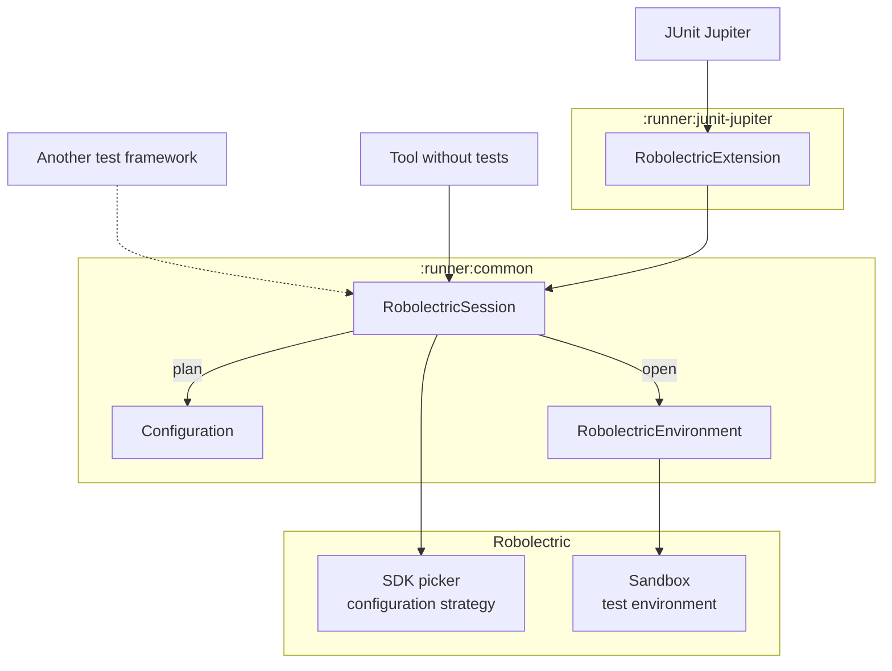
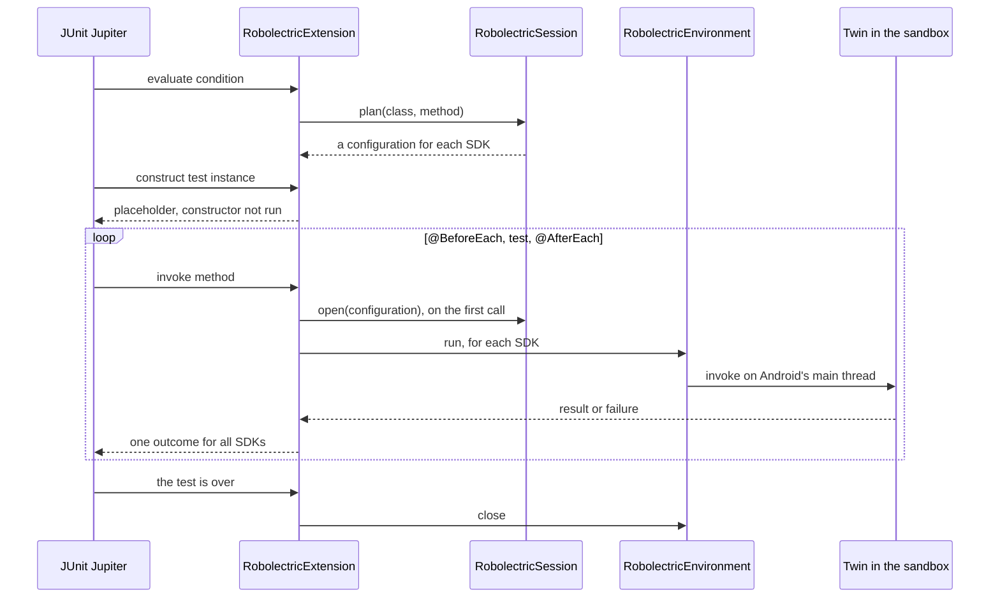

# Robolectric runners

Experimental modules that run Robolectric without the JUnit 4 `RobolectricTestRunner`, which they
leave untouched.

| Module | Artifact | Purpose |
| ------ | -------- | ------- |
| `:runner:junit-jupiter` | `runner-junit-jupiter` | `RobolectricExtension`, which runs JUnit Jupiter tests in Robolectric. |
| `:runner:common` | `runner-common` | The API that integrations with test frameworks build on, and that tools use which need Android without a test framework. |

## JUnit Jupiter

```kotlin
@ExtendWith(RobolectricExtension::class)
@Config(sdk = [33, 34])
class MyTest {
  private val context = ApplicationProvider.getApplicationContext<Context>()

  @Test
  fun usesAndroid() { // runs on both SDKs, as one test
    assertThat(context.packageName).isNotEmpty()
  }

  @RobolectricSdkTest
  fun reportsEachSdk() { // runs on both SDKs, as reportsEachSdk[33] and reportsEachSdk
    assertThat(Build.VERSION.SDK_INT).isAnyOf(33, 34)
  }
}
```

Tests are configured as with `RobolectricTestRunner`. A `@Nested` class is configured like the
class that encloses it, unless it is configured itself.

- **SDKs.** A test runs on every SDK that its configuration and `robolectric.enabledSdks` select.
  A `@Test` reports them as one test: it fails if it fails on any SDK, and says on which, and an
  assumption that fails on one SDK only skips the rest of the test there. A test that no SDK is
  selected for is skipped, with the reason.
- **`@RobolectricSdkTest`** reports each SDK as a test of its own. It replaces `@Test` on a test,
  or goes on a class, which then runs once for each SDK, as `SDK 33` and `SDK 34`, with the tests
  that are configured for that SDK.
- **Android state** is per test. A class with `@BeforeAll` or `@AfterAll` methods, or with
  `@TestInstance(PER_CLASS)`, has one environment for each SDK for all its tests. A test that is
  configured differently than the class then fails, unless it is a `@RobolectricSdkTest`, which
  gets an environment of its own.
- **Parallel execution** follows `junit.jupiter.execution.parallel.enabled`: tests that run at the
  same time have a sandbox each, unless they share the environment of their class.
- **Parameters.** Constructors, test methods and lifecycle methods can take the `Context`, the
  `Application`, an `ActivityController` or a `ServiceController`.
- **As with the runner**, an application that implements `TestLifecycleApplication` is told about
  each test, and a failure carries Robolectric's hints, such as tasks that the test left
  unexecuted on the main looper.

JUnit's own features work as JUnit defines them: inheritance, `@Nested`, `@ParameterizedTest`,
`@RepeatedTest`, `@TestFactory`, `@Timeout`, `@TestInstance`, `@TempDir`, constructor parameters,
assumptions and conditions. What doesn't is listed under [Limits](#limits).

## Architecture



- **`:runner:common` is the only module that uses Robolectric's internals.** It plans and opens
  environments the way `RobolectricTestRunner` runs a test: the SDK picker and the configuration
  strategy decide where a test runs, a sandbox is configured as the runner configures it, and the
  test environment sets up and resets the application. Its API has none of those types, so they
  can change without breaking integrations.
- **`:runner:junit-jupiter` uses only that API**, which is thereby exercised by a real
  integration.
- **No silent fallbacks.** A test that can't run as it is configured is skipped or fails with a
  message that says what to change. It never runs on another SDK or with another configuration.

### The API of `:runner:common`

```kotlin
RobolectricSession.create().use { session ->
  val configurations = session.plan(testClass, testMethod) // one for each SDK, no sandbox yet
  session.open(configurations.first()).use { environment -> // sets up Android; closing tears it down
    val twin = environment.loadClass(testClass) // the test class as the sandbox loads it
    environment.run { /* on Android's main thread: create the twin, call its methods */ }
  }
}
```

| Type | Role |
| ---- | ---- |
| `RobolectricSession` | Lives for a test run. `plan` returns a configuration for each SDK that Robolectric selects for a test, without creating a sandbox, so it can be used during test discovery. `open` sets up Android for one of them. |
| `Configuration` | Robolectric's own type for the configuration of a test: its `Config` and its modes. In one that `plan` returns, the `Config` has the SDK of the environment as its only one: `get(Config::class.java).sdk`. Two are equal if their environments are interchangeable, which tells whether a test can run in an environment that is already open. A tool without tests, such as a REPL or a preview renderer, plans from a `Config` that it builds: `session.plan(Config.Builder().setSdk(34).build())`. `robolectric.enabledSdks` doesn't apply to that. |
| `RobolectricEnvironment` | Android set up in a sandbox. `run` runs code on Android's main thread, `loadClass` returns a class as the sandbox loads it, `diagnoseFailure` adds Robolectric's hints to the failure of a test, and `close` tears Android down. |
| `RobolectricSession.Builder` | Sets the properties to use instead of the system properties, the packages that sandboxes share with the test framework rather than load again, and a `RobolectricSessionListener`, which is told when environments open and close, and how long that took. |

- **How long an environment stays open decides what shares Android state.** Open one for each
  test to isolate tests, or keep one open for a class to share state.
- **Every open environment has a sandbox to itself**, from a pool that reuses the sandboxes of
  closed environments, so a session can be used from several threads.
- **Environments are set up and torn down one at a time**, because that touches state of the whole
  JVM, such as security providers. What runs in them runs in parallel.
- **A session doesn't need JUnit 4.** Robolectric's default global configuration comes from a
  class of `RobolectricTestRunner`, so the session provides that default itself.

The API is marked `@ExperimentalRunnerApi`, and everything else in the modules is internal.

### How the extension runs a test



JUnit loads the test class itself, outside of the sandbox, where there is no Android. The
extension therefore gives JUnit a **placeholder** for the test instance, whose constructor and
field initializers don't run, and redirects every call that JUnit makes on it to a **twin**: an
instance of the same class as the sandbox loads it, constructed with the arguments that JUnit
resolved. What JUnit or another extension injects into the placeholder, such as a `@TempDir`
field, is copied into the twin.

- **JUnit drives the lifecycle.** The extension doesn't find or order lifecycle methods itself, so
  inheritance, `@Nested` classes, ordering, failures in `@AfterEach` methods, assumptions and
  conditions behave as JUnit defines them.
- **Environments live in JUnit's stores**, which close them when the test is over. A class that
  shares Android state has its environments opened before its `@BeforeAll` methods and closed
  after its `@AfterAll` methods instead.
- **Why not one instance?** JUnit could load the test classes with the sandbox's class loader,
  from a `LauncherInterceptor`. That was tried: Gradle loads the test classes itself and hands
  them to the launcher, and one class loader for a run would mean one SDK and one configuration
  for all its tests.

## Limits

JUnit itself works outside of the sandbox, and knows a `@Test` as one test:

- **Objects that JUnit passes to the twin**, as arguments or into fields, are passed as they are
  if the sandbox shares their class, as it does for those of the JDK and of JUnit. Others, such as
  objects of the test's own classes from a `@MethodSource`, are recreated in the sandbox, so they
  have to be enum constants or serializable.
- **Other extensions** see the classes as JUnit loads them. What they set up in a class that the
  sandbox loads again, such as a dispatcher of `kotlinx.coroutines`, doesn't reach the test. Set
  that up in a lifecycle method, which a test class can inherit.
- **Static initializers of a test class** run when JUnit creates its instance, so they can't use
  Android. A `@BeforeAll` method can.
- **A class with a `@RegisterExtension` field that isn't static** is constructed by JUnit, which
  takes the extension from the instance. Its constructor and field initializers can't use Android,
  and its constructor can't have Android parameters. Register the extension from a static field.
- **A `@Test` on several SDKs** is seen once by other extensions and by its time limit.
  `@RobolectricSdkTest` makes each SDK a test of its own.

State of the whole JVM is shared by all environments:

- **The default locale**, which Android sets for an environment, is that of the environment that
  is still open once another one closes, and the JVM's own again after the last one. Tests that
  run in parallel with different locales still see each other's.
- **What the code under test changes**, such as system properties, isn't isolated. JUnit's
  `@ResourceLock` and `@Isolated` keep such tests from running at the same time.
