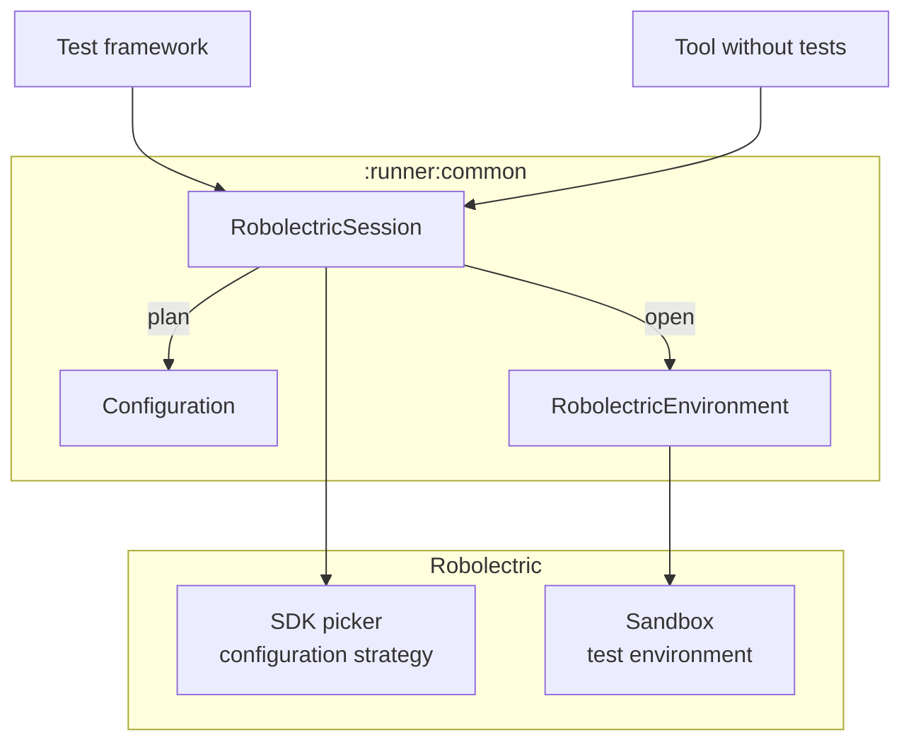

# Robolectric runners

Experimental modules that run Robolectric without the JUnit 4 `RobolectricTestRunner`, which they
leave untouched.

| Module | Artifact | Purpose |
| ------ | -------- | ------- |
| `:runner:common` | `runner-common` | The API that integrations with test frameworks build on, and that tools use which need Android without a test framework. |

## Architecture



- **`:runner:common` is the only module that uses Robolectric's internals.** It plans and opens
  environments the way `RobolectricTestRunner` runs a test: the SDK picker and the configuration
  strategy decide where a test runs, a sandbox is configured as the runner configures it, and the
  test environment sets up and resets the application. Its API has none of those types, so they
  can change without breaking integrations.
- **No silent fallbacks.** A test that can't run as it is configured has no environment planned
  for it. It never runs on another SDK or with another configuration.

### The API of `:runner:common`

```kotlin
RobolectricSession.create().use { session ->
  val configurations = session.plan(testClass, testMethod) // one for each SDK, no sandbox yet
  session.open(configurations.first()).use { environment -> // sets up Android; closing tears it down
    val twin = environment.loadClass(testClass) // the test class as the sandbox loads it
    environment.run { /* on Android's main thread: create the twin, call its methods */ }
  }
}
```

| Type | Role |
| ---- | ---- |
| `RobolectricSession` | Lives for a test run. `plan` returns a configuration for each SDK that Robolectric selects for a test, without creating a sandbox, so it can be used during test discovery. `open` sets up Android for one of them. |
| `Configuration` | Robolectric's own type for the configuration of a test: its `Config` and its modes. In one that `plan` returns, the `Config` has the SDK of the environment as its only one: `get(Config::class.java).sdk`. Two are equal if their environments are interchangeable, which tells whether a test can run in an environment that is already open. A tool without tests, such as a REPL or a preview renderer, plans from a `Config` that it builds: `session.plan(Config.Builder().setSdk(34).build())`. `robolectric.enabledSdks` doesn't apply to that. |
| `RobolectricEnvironment` | Android set up in a sandbox. `run` runs code on Android's main thread, `loadClass` returns a class as the sandbox loads it, `diagnoseFailure` adds Robolectric's hints to the failure of a test, and `close` tears Android down. |
| `RobolectricSession.Builder` | Sets the properties to use instead of the system properties, the packages that sandboxes share with the test framework rather than load again, and a `RobolectricSessionListener`, which is told when environments open and close, and how long that took. |

- **How long an environment stays open decides what shares Android state.** Open one for each
  test to isolate tests, or keep one open for a class to share state.
- **Every open environment has a sandbox to itself**, from a pool that reuses the sandboxes of
  closed environments, so a session can be used from several threads.
- **Environments are set up and torn down one at a time**, because that touches state of the whole
  JVM, such as security providers. What runs in them runs in parallel.
- **A session doesn't need JUnit 4.** Robolectric's default global configuration comes from a
  class of `RobolectricTestRunner`, so the session provides that default itself.

The API is marked `@ExperimentalRunnerApi`, and everything else in the module is internal.

## Limits

State of the whole JVM is shared by all environments:

- **The default locale**, which Android sets for an environment, is that of the environment that
  is still open once another one closes, and the JVM's own again after the last one. Environments
  that are open at the same time with different locales still see each other's.
- **What the code under test changes**, such as system properties, isn't isolated.
