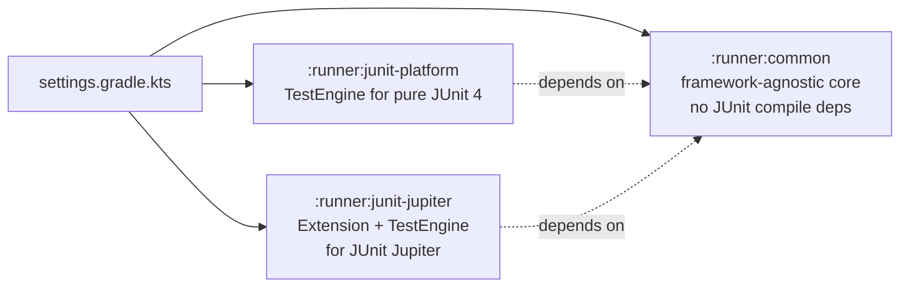
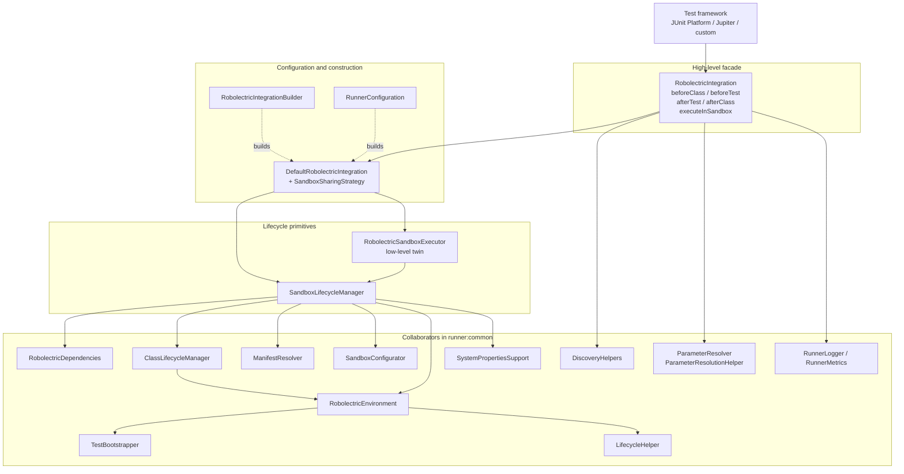
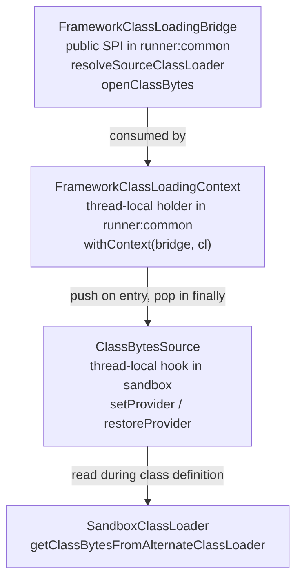
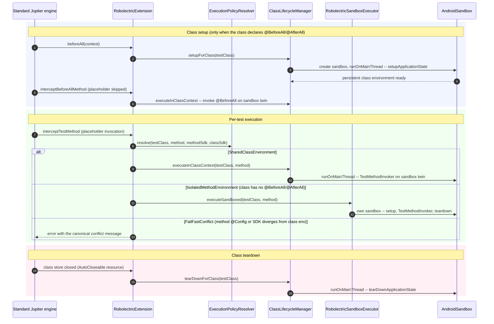

# Robolectric Runner Architecture — Design Doc

## 0. TL;DR — who should use what

- **JUnit 4 users (`@RunWith(RobolectricTestRunner::class)`)**: nothing changes. The legacy
  runner is untouched; the two paths coexist.
- **JUnit Jupiter users**: annotate classes with `@ExtendWith(RobolectricExtension::class)`
  and run them on the standard `junit-jupiter` engine. This is the recommended path; the
  feature table in §8.2 says exactly what it supports. The custom `RobolectricJupiterEngine`
  exists for plain `@Test` classes that cannot take the annotation, and requires explicit
  engine selection in the build (§6.4). `@Before`/`@After` become
  `@BeforeEach`/`@AfterEach`; `@BeforeClass`/`@AfterClass` become `@BeforeAll`/`@AfterAll`.
- **Pure JUnit Platform (`@org.junit.Test` without `@RunWith`)**: the new
  `RobolectricTestEngine` discovers `@Test` directly.
- **Framework authors**: `RobolectricIntegration` (six methods) is the intended adapter
  surface, with the caveat in §5.2 that both shipped integrations currently bypass it.
  Sandbox lifecycle, SDK selection, environment bootstrap, manifest resolution, parameter
  injection, logging, and metrics all live in `:runner:common` either way.
- **Non-test consumers** (REPLs, Compose-preview renderers): `RobolectricRuntime.launch { … }`
  boots an Android environment with no test framework at all (see §8.3).
- **API stability**: every new public symbol is annotated `@ExperimentalRunnerApi`.

---

## 1. Motivation

Robolectric historically ships a single runner (`RobolectricTestRunner`) targeting JUnit 4
via `@RunWith`. That couples the sandbox lifecycle, SDK selection, manifest resolution,
classloader bootstrapping, and JUnit 4 specifics into one class. Consequences:

- **Framework lock-in.** Running Robolectric under the JUnit Platform, JUnit Jupiter, Kotest,
  TestNG, or a custom engine requires reimplementing the same sandbox plumbing against
  Robolectric internals.
- **Hidden lifecycle.** There is no supported surface for `@BeforeAll`/`@AfterAll`-style
  shared class environments, multi-SDK discovery, or parameter injection.
- **Opaque failures.** SDK filtering (`-Drobolectric.enabledSdks`) silently drops tests when
  no SDK survives the filter.
- **No observability.** No first-class logging/metrics for sandbox reuse, SDK selection, or
  per-phase timing.
- **No custom classloader bridge.** Frameworks that transform test bytecode cannot hand their
  byte stream to the Robolectric sandbox classloader.

The runner modules address these problems with an architecture split across three Gradle
modules.

## 2. Goals / Non-goals

### Goals
- A **framework-agnostic core** (`:runner:common`): sandbox lifecycle, discovery helpers,
  parameter resolver, logging/metrics, classloader bridge.
- Two **reference integrations**: `:runner:junit-platform` (a native JUnit Platform
  `TestEngine`) and `:runner:junit-jupiter` (`RobolectricExtension` + `RobolectricJupiterEngine`).
- Keep the public surface **explicitly experimental** so the API can evolve.
- Make **SDK/sandbox discovery failures fail-fast** with diagnostic detail.
- Offer **configurable sandbox sharing** (`PER_TEST`, `PER_CLASS`, `PER_SDK`, `GLOBAL`).

### Non-goals
- Replace the existing JUnit 4 `RobolectricTestRunner`.
- Change Robolectric's bytecode instrumentation, shadow system, or Android bootstrap.
- Introduce new public API in `:robolectric` — `:runner:common` keeps an `implementation`
  dependency and reflects into `SdkCollection` where needed (see §7.3).

## 3. Module layout



Cross-cutting changes outside these modules:

- **`:sandbox`** — `ClassBytesSource.java` (new thread-local hook) and
  `SandboxClassLoader.getClassBytesFromAlternateClassLoader` now consulting that hook. This
  is what lets custom-classloader frameworks hand their bytecode to the sandbox.
- **`:testapp`** — new fixtures used by the integration tests: `StatefulActivity`,
  `ConfigChangeTestActivity`, matching `layout/` and `layout-land/` resources,
  `AndroidManifest.xml` entries.
- **`integration_tests/ctesque/.../PackageManagerTest.java`** — softened to
  `assertThat(activities.length).isAtLeast(…)` + `assertContainsActivity(…)`. This is a
  direct consequence of the new testapp activities: the old positional assertions were
  brittle and broke when `testapp`'s manifest grew. The doc records this so a future
  bisect doesn't treat it as an unrelated test edit.

## 4. High-level architecture



## 5. Design decisions

### 5.1 `RobolectricIntegration`: the façade

The central abstraction is a single interface: four lifecycle callbacks, a context
accessor, and a block-style execution method:

```kotlin
interface RobolectricIntegration {
  fun beforeClass(testClass: Class<*>)
  fun beforeTest(testClass: Class<*>, testMethod: Method)
  fun afterTest(testClass: Class<*>, testMethod: Method, success: Boolean)
  fun afterClass(testClass: Class<*>)
  fun getContext(testClass: Class<*>): TestExecutionContext?
  fun <T> executeInSandbox(
    testClass: Class<*>, testMethod: Method, block: (TestExecutionContext) -> T
  ): T
}
```

The idea: every supported framework can be modeled as a sequence of class/test
entry-and-exit events plus "run this block inside the sandbox", so a new framework needs a
small adapter, not a rewrite. Whether that holds is an open question — see the honesty note
at the end of §5.2.

### 5.2 Two-level API: low-level executor + high-level integration

`:runner:common` deliberately exposes **two** entry points at different abstraction levels:

| Level        | Class                         | Used by                             | Scope                          |
| ------------ | ----------------------------- | ----------------------------------- | ------------------------------ |
| Low-level    | `RobolectricSandboxExecutor`  | `RobolectricTestEngine` (Platform)  | one test → one sandbox         |
| Low-level    | `SandboxLifecycleManager`     | `RobolectricJupiterEngine`, `RobolectricExtension` | sandbox create/execute primitives |
| High-level   | `RobolectricIntegration`      | framework adapters, most consumers  | full lifecycle, caching, sharing |

The Jupiter extension path uses the low-level primitives directly because it must
participate in Jupiter's own `ExtensionContext` and `InvocationInterceptor` protocols;
the façade's lifecycle calls would clash with them. The Platform engine (simpler model:
"given a test, run it") uses `RobolectricSandboxExecutor` directly.

An honesty note: as of today, **no shipped integration uses the façade**. Both engines and
the extension dropped to the primitives, each for defensible reasons, which means
`RobolectricIntegration` has never been validated by a real adapter. Framework authors
should still start there, but if the next real integration also has to bypass it, that is
evidence the façade needs redesign, not that the adapter is doing it wrong.

### 5.3 Configuration: `RobolectricIntegrationBuilder` + `RunnerConfiguration`

One canonical builder, one value DTO, and no overlap in their responsibilities.

- **`RobolectricIntegrationBuilder`** is the canonical constructor. Fluent API with presets
  (`forJUnitPlatform()`, `forJUnitJupiter()`, `fromSystemProperties()`). Directly builds a
  `DefaultRobolectricIntegration`. Accepts `FrameworkClassLoadingBridge`, `LifecycleAnnotations`,
  and `TestFilter`. `build()` applies observability side-effects (`RunnerLogger.isDebugEnabled`,
  `RunnerMetrics.enable()`) — construction of the builder itself is side-effect-free.
- **`RunnerConfiguration`** is the transferable DTO. It carries the same fields plus an
  optional `classLoadingBridge`. `createIntegration()` / `createIntegration(deps)` delegate to
  `RobolectricIntegrationBuilder().fromConfig(this).build()`. Call `validate()` to check the
  `timingEnabled ⇒ metricsEnabled` invariant — validation is explicit rather than in an
  `init { }` block so DTO construction stays side-effect-free too.

Rule of thumb: if you're composing an integration imperatively, use the builder; if you're
producing a config that will be stashed, serialized, or passed across modules, use
`RunnerConfiguration` and hand it to the builder via `fromConfig`.

### 5.4 Sandbox sharing strategies + `SandboxSharingPolicy`

```kotlin
enum class SandboxSharingStrategy { PER_TEST, PER_CLASS, PER_SDK, GLOBAL }
```

| Strategy    | Cache key                          | Isolation | Speed   | Multi-SDK  | Use case                               |
| ----------- | ---------------------------------- | --------- | ------- | ---------- | -------------------------------------- |
| `PER_TEST`  | `"${class.name}.${method.name}"`   | maximum   | slowest | any        | diagnostic runs, state-heavy tests     |
| `PER_CLASS` | `Class<*>` identity                | per class | medium  | same class | **default** — balances isolation/speed |
| `PER_SDK`   | `sdk.apiLevel` (Int)               | per SDK   | fast    | yes        | large suites with many SDKs            |
| `GLOBAL`    | `@Volatile` single field           | none      | fastest | single SDK | micro-benchmarks, tight control        |

The strategy maps to an internal `sealed interface SandboxSharingPolicy` with one class per
value (`PerTestPolicy`, `PerClassPolicy`, `PerSdkPolicy`, `GlobalPolicy`). Each policy owns:

- Its own cache (`ConcurrentHashMap` keyed as in the table above; `GlobalPolicy` uses a
  `@Volatile` field + synchronized initializer).
- Its own `beforeClass` / `beforeTest` / `afterTest` / `afterClass` logic.
- Its own `RunnerMetrics` cache-hit / cache-miss / create / teardown events.

`DefaultRobolectricIntegration` delegates each lifecycle callback straight to the policy.
The façade keeps only cross-strategy concerns: `RunnerLogger.debug` events,
`executeInSandbox` on the sandbox main thread, and `InvocationTargetException` unwrapping.
The policy is internal; framework adapters go through the façade or the low-level
primitives, never the policy directly.

Scope warning: sharing strategies apply to façade users only. The shipped engines never
read `SandboxSharingStrategy` — they hard-wire their own sharing (a persistent class
environment via `ClassLifecycleManager` when the class declares class lifecycle, isolated
per-method sandboxes otherwise). There is currently no way to run the shipped engines in,
say, `PER_SDK` mode.

### 5.5 Classloader bridge: three layers

Frameworks like Kotest transform test bytecode and load it through their own classloaders.
Robolectric's sandbox still needs to *define* those classes itself so instrumentation
applies. The bridge has three layers:



The invariant that keeps this safe: `FrameworkClassLoadingContext` is the only code that
writes to `ClassBytesSource`. `RobolectricEnvironment.access` wraps every sandbox-side block in
`FrameworkClassLoadingContext.withContext(bridge, sourceClassLoader) { block() }`, so the
thread-local is always balanced with its caller frame. Framework integrators should not
touch `ClassBytesSource` directly.

### 5.6 `SandboxLifecycleManager` and contexts

`SandboxLifecycleManager` separates three responsibilities:

- **Creation.** `createSandbox` returns a single `SandboxContext`; `createSandboxes` returns
  one per selected SDK (multi-SDK parameterization). Inside creation,
  `withContextClassLoader(sourceClassLoader) { sandboxManager.getAndroidSandbox(…) }`
  temporarily installs the framework's source classloader as the thread context classloader
  so the sandbox manager can resolve classpath URLs from it. This is a *separate* mechanism
  from the byte-bridge in §5.5 — that one applies while the *test* runs, this one applies
  while the *sandbox* is being constructed.
- **Configuration.** A collaborator `SandboxConfigurator` handles the "how to configure it"
  question (looper mode, SQLite mode, graphics mode, resources mode, shadow map,
  interceptors), decoupled from "which sandbox" decisions.
- **Execution.** `executeInSandbox(context, testName, configuration?)` builds (or reuses) a
  `RobolectricEnvironment` and forwards to `environment.executeInSandbox`, which acquires a
  re-entrant lock via `access { }`.

### 5.7 `ClassLifecycleManager`: class-scoped environments with per-method override

JUnit Jupiter's `@BeforeAll`/`@AfterAll` and JUnit 4's `@BeforeClass`/`@AfterClass` need a
sandbox that survives across a whole class. `ClassLifecycleManager` owns a single
`ConcurrentHashMap` of `ClassState(context, environment)` records and exposes:

- `setupForClass` — creates or reuses a class-level `SandboxContext`, initializes the
  Android environment once.
- `tearDownForClass` — tears the environment down on the sandbox main thread.
- `executeInClassContext(testClass, methodName, configuration = null, block)` — the key
  primitive:
  - `configuration == null` → block runs inside the **persistent** class environment
    (reused across `@BeforeAll` / tests / `@AfterAll`).
  - `configuration != null` → block runs in an **isolated per-method environment** that
    still reuses the class-level sandbox/classloader. No shipped engine calls this mode
    today: under the canonical policy (§8.2) a method-level `@Config` override on a class
    with class lifecycle fails fast instead, and classes without class lifecycle get fully
    isolated sandboxes through `RobolectricSandboxExecutor`. The mode stays available for
    adapters that want per-method configuration on top of a shared sandbox;
    `ClassLifecycleManagerIntegrationTest` pins its behavior.

### 5.8 `LifecycleAnnotations`: runtime-resolved, compile-decoupled

`LifecycleAnnotations` is an enum (`JUNIT4`, `JUNIT5`, `JUNIT_COMBINED`, `NONE`) that stores
annotation **class names** and resolves them to `Class<out Annotation>` on first use via
`Class.forName(name)`, swallowing `ClassNotFoundException`. This is the mechanism that keeps
`:runner:common` free of JUnit compile dependencies while still shipping JUnit presets —
without it, the module couldn't reference `org.junit.jupiter.api.BeforeEach.class` at all.

### 5.9 Discovery & SDK parameterization

`DiscoveryHelpers` is the **only** discovery surface in `:runner:common` and deliberately
framework-agnostic:

- `isTestMethod` / `discoverTestMethods(testClass, testAnnotations)` / `discoverTestMethodsByName`
  — the last accepts annotation **class names** so Jupiter and JUnit 4 share the same
  discovery path.
- `createSdkVariants(testClass, method, deps, baseUniqueId, alwaysIncludeSdkInName)` —
  expands each test method into one `SdkTestVariant` per SDK the `SdkPicker` returns.

JUnit-Platform-specific descriptor construction (`TestDescriptor`, `UniqueId`,
`MethodSource`, `EngineDescriptor`) lives **in the engine modules**
(`PlatformDescriptorBuilders`, `JupiterDescriptorBuilders`), not in `:runner:common`.

**SDK test name format.** `SystemPropertiesSupport.formatTestName` appends `[<sdk>]` when
either (a) `-Drobolectric.alwaysIncludeVariantMarkersInTestName=true` or (b) this is not
the last SDK. Concretely, with SDKs `[30, 33, 34]` selected and default properties:

| Variant | Display name       | Unique-id segment |
| ------- | ------------------ | ----------------- |
| SDK 30  | `testFoo[30]`      | `sdk:30`          |
| SDK 33  | `testFoo[33]`      | `sdk:33`          |
| SDK 34  | `testFoo`          | `sdk:34`          |

The last-variant omission is deliberate — it preserves IDE click-to-navigate on single-SDK
runs. Setting `alwaysIncludeVariantMarkersInTestName=true` forces all three to carry the
marker.

### 5.10 Observability: `RunnerLogger` and `RunnerMetrics`

Two zero-dependency singletons keyed on system properties:

- `robolectric.runner.debug` → `RunnerLogger` emits structured events (test start/end, SDK
  selection, sandbox creation, class context create/reuse/teardown, SDK fallback warnings).
- `robolectric.runner.metrics` → `RunnerMetrics` counts sandbox creations, teardowns, cache
  hits/misses, test successes/failures.
- `robolectric.runner.metrics.timing` → per-phase timings
  (`PHASE_SANDBOX_CREATION`, `PHASE_ENVIRONMENT_SETUP`, `PHASE_ENVIRONMENT_TEARDOWN`,
  `PHASE_CLASS_SETUP`, `PHASE_CLASS_TEARDOWN`, `PHASE_TEST_EXECUTION`). A `timed(phase) { … }`
  helper wraps blocks so callers don't manage clock state.

Both singletons are framework-agnostic and used uniformly by `DefaultRobolectricIntegration`,
`SandboxLifecycleManager`, and both engines.

### 5.11 `SdkFallbackResolver`: one place for the enabledSdks fallback

When `-Drobolectric.enabledSdks` filters every SDK out of `SdkPicker.selectSdks`, the runner
needs a fallback. The reflection-into-`SdkCollection` logic for it lives in exactly one
place:

```kotlin
SdkFallbackResolver.resolveFallbackSdk(deps, testClass, testMethod, config): Sdk?
```

- Returns the first `@Config(sdk = …)` entry looked up through `SdkCollection.getSdk(int)`.
- If `@Config(sdk)` is empty, returns the latest known SDK from `SdkCollection.getKnownSdks()`.
- Returns `null` only if `SdkCollection` itself cannot be loaded (hard failure — callers
  should throw with diagnostic detail).
- Emits a stderr `WARNING:` and a `RunnerLogger.logSdkFallback` entry in the first two cases
  so the divergence is observable.

`SandboxLifecycleManager.createSandboxes`, `MethodSdkResolver` (which both Jupiter paths
use), and `RobolectricTestEngine`'s legacy-method branch all call this helper. When
`SdkCollection` moves to `:pluginapi`, the reflection inside the helper goes away; the call
sites stay the same.

### 5.12 `TestMethodInvoker`: one "bootstrap + @Before + invoke + @After" helper

Every execution path needs the same bootstrap/invoke/lifecycle sequence, so it is a single
call:

```kotlin
TestMethodInvoker.invoke(
  sandbox, testClass, testMethod,
  beforeEachAnnotations, afterEachAnnotations,
  parameterResolver,
)
```

The helper:
1. Bootstraps `testClass` through `TestBootstrapper`.
2. Invokes every `@BeforeEach`/`@Before`-style method the caller lists (order handled by
   `LifecycleHelper`).
3. Invokes the test method, resolving parameters via the supplied `ParameterResolver` (which
   defaults to `DefaultRobolectricParameterResolver`). `InvocationTargetException` is
   unwrapped so assertion errors propagate naturally.
4. Runs `@AfterEach`/`@After`-style methods in reverse order inside a `finally` block.
   Failures here are logged via `RunnerLogger.error` and do not mask a test-body failure.

Callers are responsible for arranging execution on the sandbox main thread — the helper is
stateless and doesn't schedule on `sandbox.runOnMainThread` so callers can decide whether to
wrap one method or many.

### 5.13 `ParameterResolver`: now end-to-end

Every link in the chain respects the injected resolver:

- `ParameterResolutionHelper.resolveParameters(parameters, sandbox, resolver)` takes a
  `ParameterResolver` parameter (defaulting to the Robolectric built-in). Unknown parameter
  types produce a clear `IllegalArgumentException` that names the offending type and points
  users at the builder.
- `TestMethodInvoker.invoke(..., parameterResolver = …)` forwards the resolver.
- Both engines accept a constructor-level `parameterResolver` (defaulting to the built-in) and
  pass it to `TestMethodInvoker`. Framework authors using a custom `RobolectricExtension`-ish
  adapter can plug in their own resolver.

### 5.14 `DiscoveryHelpers.isTestMethod`: extensible for non-JUnit frameworks

`DiscoveryHelpers.isTestMethod(method, annotationNames)` accepts a `Set<String>` of
fully-qualified annotation class names. The default is `DEFAULT_TEST_ANNOTATION_NAMES` (JUnit 4
+ Jupiter). Kotest/TestNG-style frameworks can union their own names with the default:

```kotlin
val names = DiscoveryHelpers.DEFAULT_TEST_ANNOTATION_NAMES + "io.kotest.core.annotation.Test"
DiscoveryHelpers.isTestMethod(method, names)
```

Matching is by FQCN, not `Class` identity — this makes discovery robust across classloader
boundaries (framework-transformed classes still resolve).

## 6. Implementation details

### 6.1 Thread/concurrency model

| Site                                                | Thread requirement                                                                                              |
| --------------------------------------------------- | --------------------------------------------------------------------------------------------------------------- |
| `RobolectricDependencies.create()`                  | any thread                                                                                                      |
| `SandboxLifecycleManager.createSandbox(es)`         | any thread; installs source classloader as thread CCL during `sandboxManager.getAndroidSandbox`                 |
| `SandboxLifecycleManager.executeInSandbox`          | **must** be called from the sandbox main thread — callers wrap with `sandbox.runOnMainThread(Callable)`         |
| `AndroidSandbox.runOnMainThread`                    | single-threaded executor **per sandbox**; serializes all work on that sandbox                                   |
| `RobolectricEnvironment`                            | **not** thread-safe internally — relies on the sandbox main thread being single-threaded                        |
| `RobolectricEnvironment.access { }`                 | sets CCL to sandbox CL + pushes `FrameworkClassLoadingContext`; always balanced in `finally`                    |
| `ClassLifecycleManager` maps                        | `ConcurrentHashMap` — engines may discover/execute classes in parallel                                          |
| `SandboxSharingPolicy` (per-strategy caches)        | `ConcurrentHashMap` + one `@Volatile` — see §5.4. Each sealed type owns its own cache; no shared mutable state  |
| `ClassBytesSource`                                  | thread-local — safe **only** when every entry goes through `FrameworkClassLoadingContext.withContext` push/pop  |
| `RunnerLogger` / `RunnerMetrics`                    | internally synchronized; safe from any thread                                                                   |
| `RobolectricExtension` state                        | stored in `ExtensionContext.Store` with namespace `RobolectricExtension::class`; root-store caches `RobolectricDependencies` + `SandboxLifecycleManager` across the whole run |

Invariants worth preserving:

- A sandbox main thread is **pinned** — reflective invocation of the test body, lifecycle
  methods, and environment setup/teardown all run on it.
- The `ClassBytesSource` provider is thread-local and the *entering* frame pushes and the
  *same* frame pops in `finally`. A leaked provider would cause the next unrelated sandbox
  load on that thread to consume framework bytes.

### 6.2 Error handling

- **SDK resolution.** `createSandboxes` throws `IllegalStateException` when `SdkPicker`
  returns empty **and** the reflective fallback into `SdkCollection` also fails; the message
  carries the `fallbackReflectionFailure` cause. The previous "silently zero tests" failure
  mode is gone.
- **SDK fallback.** When `-Drobolectric.enabledSdks` filters out configured SDKs, the code
  falls back to the first `@Config(sdk)` (or latest known SDK) and both emits
  `WARNING:` to stderr and records `RunnerLogger.logSdkFallback`. The run doesn't silently
  succeed on the wrong SDK.
- **Test execution.** `RobolectricSandboxExecutor.executeSandboxed` throws;
  `executeSandboxedSafe` returns an `ExecutionResult` sealed class
  (`Success(duration)` / `Failure(error, duration)` / `Skipped(reason)`).
  `InvocationTargetException` is unwrapped so the framework sees the real test failure.

### 6.3 Reflection into `SdkCollection`

`:runner:common` depends on `:robolectric` with `implementation` rather than `api`, to keep
internal Robolectric classes out of the experimental public API. `SandboxLifecycleManager`
therefore reflects into `org.robolectric.plugins.SdkCollection` (`getSdk(int)` and
`getKnownSdks`) only for the fallback path described above. The comment in source flags
this as a future refactor target: if `SdkCollection` moves to `:pluginapi`, the reflection
is removed.

### 6.4 Engine coexistence

`MultiEngineCoexistenceTest` (in `:runner:junit-platform/src/test`) exercises the case
where both the Platform engine and the Jupiter engine are on the classpath — the common
IDE/Gradle setup. The invariants:

- A JUnit 4 `@org.junit.Test` without `@RunWith` is picked up by the Platform engine only.
- The Jupiter engine ignores non-Jupiter tests.
- `@RunWith(RobolectricTestRunner::class)` is handled by the JUnit 4 vintage engine, not by
  the new engines.
- There is no double-discovery: the engines are distinct `TestEngine` implementations with
  different `getId()` values and service declarations.

One case the engines cannot solve for you: a plain Jupiter test class with no
`@ExtendWith(RobolectricExtension)` annotation is a legitimate discovery target for *both*
the standard `junit-jupiter` engine and `RobolectricJupiterEngine`. With both on the
classpath and a bare `useJUnitPlatform()` in Gradle, that class runs twice — once sandboxed
by the custom engine, once plain by the standard engine, where its Android calls fail with
confusing errors. The §8.2 coexistence guard only covers annotated classes; the standard
engine knows nothing about Robolectric and cannot be taught to skip. Builds adopting the
custom engine must select engines per test task:

```kotlin
tasks.test { useJUnitPlatform { includeEngines("robolectric-junit-jupiter-engine") } }
```

This repository's own `runner:junit-jupiter` build does exactly this, with a second test
task for the standard engine. Annotating every class with `@ExtendWith` and skipping the
custom engine avoids the problem entirely, which is one more reason the extension is the
recommended path.

## 7. Sequence diagram — the hot path

The extension path with a class-level environment, including all three policy outcomes.
The custom engine's flow differs only in who calls the same collaborators (it drives
lifecycle itself instead of intercepting Jupiter's).



Three things to notice:

1. **The placeholder invocation is always consumed.** Jupiter invokes methods on its own
   instance; the extension skips that invocation and re-invokes the equivalent method on
   the sandbox-loaded twin. The test body only ever runs inside the sandbox.
2. **One policy object decides the branch.** `ExecutionPolicyResolver` is the same object
   the custom engine consults, so the two paths cannot disagree about where a method runs.
3. **Two classloader mechanisms.** During sandbox construction the thread CCL is
   temporarily the framework's source loader. During execution (inside `access`) the
   thread CCL is the sandbox loader and `ClassBytesSource` has a provider set. These do
   not overlap.

## 8. Reference integrations

### 8.1 `:runner:junit-platform` — `RobolectricTestEngine`

A native `org.junit.platform.engine.TestEngine` (service-loaded via
`META-INF/services/org.junit.platform.engine.TestEngine`). Accepts an optional
`parameterResolver` constructor argument (defaults to `DefaultRobolectricParameterResolver`).

1. **Discovery.** Accepts `ClassSelector`/`MethodSelector`. For each test method, asks
   `SandboxLifecycleManager.createSandboxes` for SDK contexts and emits one descriptor per
   SDK via `PlatformDescriptorBuilders`. Legacy non-parameterized descriptors flow through
   `SdkFallbackResolver` when `SdkPicker` returns empty.
2. **Execution.** Delegates to `TestMethodInvoker` (which handles bootstrap, `@Before`/
   `@BeforeEach`, parameter resolution via the injected `ParameterResolver`, invocation, and
   `@After`/`@AfterEach`). Class-level lifecycle is driven through `ClassLifecycleManager`,
   detected via `LifecycleHelper.hasLifecycleMethods(...)`. `ExecutionResult` carries
   pass/fail/skipped plus duration back to the platform listener.

The Platform engine honors both JUnit 4 `@Before`/`@After` and Jupiter
`@BeforeEach`/`@AfterEach` per-test lifecycle, keyed via
`LifecycleAnnotations.JUNIT_COMBINED`; `BeforeAllAfterAllPlatformTest` pins this.

### 8.2 `:runner:junit-jupiter` — two entry points, one execution policy

Both Jupiter entry points route per-method execution through the shared
`ExecutionPolicyResolver` in `:runner:common`, so a test class behaves identically on either
path. The canonical, explicit-intent-based policy:

- **No class lifecycle** (`@BeforeAll`/`@AfterAll` absent): every test runs in an isolated
  per-method environment honoring full method-level `@Config` — classic Robolectric
  semantics.
- **Class lifecycle present:** a method whose effective configuration matches the class
  environment shares it; `@RobolectricSdkTest` explicitly opts into isolated per-SDK
  sandboxes (class-environment state is not visible there); *implicit* divergence — plain
  method-level `@Config` overrides, or multi-SDK variant expansion — fails fast with an
  actionable message.

The entry points:

- **Extension path** (`@ExtendWith(RobolectricExtension::class)`), on the standard
  `junit-jupiter` engine. Jupiter instantiates the test class on the application classloader,
  but Robolectric tests must run on sandbox-loaded classes — and Jupiter's
  `TestInstanceFactory` validation rejects instances from a foreign classloader. The
  extension therefore treats Jupiter's instance as a **placeholder**: it implements
  `InvocationInterceptor` and skips every test/`@BeforeEach`/`@AfterEach`/`@BeforeAll`/
  `@AfterAll` invocation, re-invoking the equivalent method on a sandbox-loaded twin (via
  `TestMethodInvoker` / `TestBootstrapper`). It also implements Jupiter's
  `ParameterResolver`, reporting placeholders for supported Android parameter types; real
  arguments are resolved sandbox-side. Shared state (dependencies, sandbox manager, sandbox
  executor) is cached on the root `ExtensionContext.Store`; the class environment is created
  in `beforeAll` **only when the class declares `@BeforeAll`/`@AfterAll`** and is torn down
  via an `AutoCloseable` store resource.

  The placeholder model has one rule users must know: constructors and instance-field
  initializers run on the application classloader, where no Android environment exists.
  An `ApplicationProvider.getApplicationContext()` call in a field initializer dies with
  `No instrumentation registered!` before any test runs. Move such work into `@BeforeEach`
  or a Kotlin `lazy` initializer — the twin's initializers evaluate inside the sandbox, so
  laziness is enough.
- **Engine path** (`RobolectricJupiterEngine`). A full `TestEngine` with Jupiter-style
  discovery: `@Nested` classes, per-SDK variant descriptors (matching the Platform engine's
  `(method, sdk)` parameterization under `-Drobolectric.enabledSdks`), `@Disabled` reported
  as skipped, and **fail-loudly descriptors** for test kinds it cannot execute
  (`@TestTemplate`-based — including `@ParameterizedTest`, `@RepeatedTest`,
  `@RobolectricSdkTest` — and `@TestFactory`): such methods are discovered and fail with a
  message directing users to the extension path, so no test can silently vanish. This path
  does **not** invoke `@ExtendWith` extensions; it drives lifecycle itself via
  `LifecycleHelper`.

**Coexistence guard.** The engine skips classes annotated
`@ExtendWith(RobolectricExtension)` (directly, via `@Extensions`, meta-annotations, or an
enclosing class) at discovery. Annotated classes belong to the standard engine; unannotated
ones to the custom engine. Having both engines on the classpath therefore never double-runs
a class.

Both paths share `RobolectricDependencies`, `SandboxLifecycleManager`, `ClassLifecycleManager`,
`TestBootstrapper`, `TestMethodInvoker`, `ExecutionPolicyResolver`, `MethodSdkResolver`,
`SdkFallbackResolver`, and `ParameterResolver`. `EnginePathParityTest` executes twin fixtures
on both paths and asserts identical outcomes, so the paths cannot drift silently.

**Jupiter feature support.** What each path does with the rest of the Jupiter feature set,
as implemented today:

| Feature | Extension path (standard engine) | Engine path (`RobolectricJupiterEngine`) |
| ------- | -------------------------------- | ---------------------------------------- |
| `@Test`, `@BeforeEach`/`@AfterEach`, `@BeforeAll`/`@AfterAll` | supported | supported |
| `@Nested` | expected to work — `TestBootstrapper` instantiates inner twins with their outer instance — but not yet pinned by a test | supported in discovery |
| `@Disabled` and other execution conditions | supported; the standard engine evaluates them | `@Disabled` honored; other conditions are not evaluated |
| `@RobolectricSdkTest` | supported (per-SDK isolated sandboxes) | fails loudly, points to the extension |
| `@ParameterizedTest`, `@RepeatedTest` | invocations run, but framework-provided arguments (`@ValueSource` values, `RepetitionInfo`) cannot cross into the twin; only Robolectric-resolvable parameter types work, anything else fails during sandbox-side parameter resolution with the offending type named | fails loudly |
| `@TestFactory` | unsupported and currently *silent*: there is no factory interceptor, so the factory and its dynamic tests run on the placeholder, outside the sandbox | fails loudly |
| `@TestInstance(PER_CLASS)` | the placeholder honors it, but the twin is recreated per invocation, so instance-field state never carries between tests; only static state in the shared class environment does | n/a — the engine drives lifecycle itself |
| `@Timeout` | fires on the calling thread; the sandboxed work is not cancelled and keeps running on the sandbox main thread | not evaluated |
| Assumptions (`TestAbortedException`) | propagate from the twin unwrapped, so aborted-test reporting works | propagate |
| Other `@ExtendWith` extensions | run normally on the placeholder side; they cannot observe sandbox state | not invoked |
| Parallel execution (`junit.jupiter.execution.parallel.*`) | untested; keep it off | untested; keep it off |

The `@TestFactory` and argument-injection rows are gaps, not design choices; §9 tracks
them. Note the engine's fail-loudly message for template and factory methods points users
at the extension path, which — per this table — only actually helps for
`@RobolectricSdkTest` today.

### 8.3 `RobolectricRuntime` — framework-free entry point

`RobolectricRuntime` (in `:runner:common`) boots the Android environment without any test
framework, for REPLs, Compose-preview renderers, and similar tools:

```kotlin
RobolectricRuntime.launch { sdk = 34 }.use { runtime ->
  val sdkInt = runtime.execute(Callable {
    Class.forName("android.os.Build\$VERSION", true, Thread.currentThread().contextClassLoader)
      .getField("SDK_INT").getInt(null)
  })
}
```

- `launch { … }` resolves configuration by overlaying the builder's values onto the
  configuration strategy's defaults (`SandboxLifecycleManager.createSandboxForConfig`, which
  needs no test class), creates the sandbox, and sets up a persistent application state.
- `execute(Callable)` runs the block on the sandbox main thread with the context classloader
  set to the sandbox loader — the reflection-driven path.
- `executeLoaded(className, methodName, …)` loads the named class through the sandbox
  classloader (twin semantics) for code whose bytecode references `android.*` directly.
- `close()` tears the environment down; the class is `AutoCloseable` and idempotent.

The classloader contract is documented on the class KDoc; `NoClassDefFoundError`s for
`android.*` types thrown from `execute` are rewrapped with a pointer to `executeLoaded`.

## 9. Trade-offs and known limitations

- **API instability.** Every public symbol is `@ExperimentalRunnerApi`; the doc commits to
  that annotation staying in place until the API stabilizes.
- **`SdkCollection` reflection.** See §6.3. Acceptable short-term; replace when a typed API
  exists in `:pluginapi`.
- **Two Jupiter entry points.** Doubles the test surface. The integration matrix doc
  (`runner-integration-matrix.md`) states which components each path uses; the test tree
  exercises both, and `EnginePathParityTest` pins their behavioral parity. The engine's
  remaining niche is zero-annotation adoption of plain `@Test` classes, which comes with
  the §6.4 engine-selection burden. If that niche never earns its keep, deprecating the
  engine in favor of the extension is the natural end state.
- **Platform-engine conflict divergence.** The Jupiter paths fail fast when a per-SDK
  variant (or plain method `@Config` override) conflicts with a shared class environment.
  The Platform engine (`RobolectricTestEngine`) instead silently falls back to an isolated
  per-variant sandbox when the variant SDK differs from the class context. This is a known
  divergence from the canonical `ExecutionPolicyResolver` semantics; aligning the Platform
  engine is deliberate follow-up work (it would change released behavior and the Platform
  engine has no `@RobolectricSdkTest`-style explicit opt-in yet).
- **`PER_SDK`/`GLOBAL` sharing.** Fast but fragile for tests that mutate static state. Both
  the README and the `SandboxSharingStrategy` KDoc call this out explicitly.
- **Thread-local `ClassBytesSource`.** Requires bridges to push/pop through
  `FrameworkClassLoadingContext`. Direct use is strongly discouraged.
- **`RunnerConfiguration` lacks a classloader bridge setter.** Mirror it or route
  custom-classloader integrations through `RobolectricIntegrationBuilder`.
- **Extension gaps: `@TestFactory` and framework-provided arguments.** See the feature
  table in §8.2. `@TestFactory` silently escapes the sandbox (no factory interceptor);
  `@ParameterizedTest`/`@RepeatedTest` arguments cannot be injected into the twin. The
  first needs an `interceptTestFactoryMethod` implementation, the second needs argument
  transport across the classloader boundary. Until one of those lands, the engine's
  redirect message for these kinds overpromises.
- **Parallel execution is unvalidated.** The shared-state model is thread-safe by
  construction (per-sandbox main threads, concurrent maps, store-scoped caches), but
  nobody has run the suites with `junit.jupiter.execution.parallel.enabled=true` and
  meant it. Treat it as unsupported until it is tested.
- **The unannotated-class double-run.** §6.4: adopting the custom engine without an
  `includeEngines` filter double-runs plain Jupiter classes. This is inherent to the
  two-engine design, not fixable from our side, and is documented rather than solved.

## 10. Files to read first (before the rest)

If reviewing the runner modules, read these seven files in order — they encode the entire
design. Everything else is plumbing or tests.

1. `runner/common/.../RobolectricIntegration.kt` — the façade contract.
2. `runner/common/.../SandboxLifecycleManager.kt` + `SdkFallbackResolver.kt` — creation,
   SDK selection, shared fallback.
3. `runner/common/.../ClassLifecycleManager.kt` — the persistent-vs-per-method mode, now
   backed by a single `ClassState` record.
4. `runner/common/.../SandboxSharingPolicy.kt` — the sealed-interface split that replaced
   `DefaultRobolectricIntegration`'s four-way `when` branches.
5. `runner/common/.../TestMethodInvoker.kt` — the canonical bootstrap + lifecycle + invoke
   helper that both engines now call.
6. `runner/common/.../FrameworkClassLoadingContext.kt` + `sandbox/.../ClassBytesSource.java`
   — the bytecode bridge (two short files, read together).
7. Either `runner/junit-platform/.../RobolectricTestEngine.kt` **or**
   `runner/junit-jupiter/.../RobolectricJupiterEngine.kt` — see one end-to-end use.

Companion docs: `runner/common/README.md`,
`runner/common/docs/runner-api-inventory.md`,
`runner/common/docs/runner-integration-matrix.md`.
