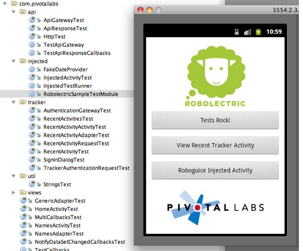

## Getting Started
[RobolectricSample](http://github.com/pivotal/RobolectricSample) is a Maven-enabled sample app shows how to layout your project, includes example tests, and a `build.xml` file for compiling and
running tests.

### Sample Tests
[RobolectricSample's own tests](https://github.com/pivotal/RobolectricSample/tree/master/src/test/java/com/pivotallabs) are an excellent source for sample test code. Of note:

* **[HomeActivityTest.java](https://github.com/pivotal/RobolectricSample/blob/master/src/test/java/com/pivotallabs/HomeActivityTest.java)**: a simple Activity test exercising Buttons, presence of Images.
* **[LoadingTextViewTest.java](https://github.com/pivotal/RobolectricSample/blob/master/src/test/java/com/pivotallabs/views/LoadingTextViewTest.java)**: Testing custom views.
* **[HttpTest.java](https://github.com/pivotal/RobolectricSample/blob/master/src/test/java/com/pivotallabs/api/HttpTest.java)**: Testing HTTP requests and responses.
* **[ApiGatewayTest.java](https://github.com/pivotal/RobolectricSample/blob/master/src/test/java/com/pivotallabs/api/ApiGatewayTest.java)**: More HTTP traffic tests; incorporates pausing and resuming the background scheduler.
* **[InjectedActivityTest.java](https://github.com/pivotal/RobolectricSample/blob/master/src/test/java/com/pivotallabs/injected/InjectedActivityTest.java)**: Example of using [RoboGuice](http://code.google.com/p/roboguice/ "roboguice - Google Guice on Android - Google Project Hosting") dependency injection.

## Android IntelliJ Starter
Another resource, especially for IntelliJ users, is the [Android IntelliJ Starter](https://github.com/pivotal/AndroidIntelliJStarter).  This "template" project configures Robolectric as a [git submodule](http://kernel.org/pub/software/scm/git/docs/git-submodule.html "git-submodule(1)"). 

## Test Annotations
Robolectric must have an opportunity to intercept the class loading process of the Android classes to make this all work. This is done by adding the JUnit annotation to your tests. JUnit will defer processing of the Test file to the class defined in the  `@RunWith(RobolectricTestRunner.class)` annotation. The `RobolectricTestRunner.class` sets up your test to run with Robolectric.  

For example: 
    
    @RunWith(RobolectricTestRunner.class)  // <== REQUIRED for Robolectric! 
    public class HomeActivityTest {
        @Test
        public void shouldHaveAButtonThatSaysPressMe() throws Exception {
	        // test code here
        }
    
##  `Robolectric.shadowOf()`
Sometimes Android classes don't provide methods to access the state of the Android objects under test. The
 `Robolectric.shadowOf()` methods provide reference to the shadow instances representing Android objects,
allowing tests to assert on state otherwise not available.

Suppose the application assigns a drawable resource id on an  `ImageView` in layout xml, like this:


<ImageView
    android:id="@+id/pivotal_logo"
    android:layout_width="fill_parent"
    android:layout_height="wrap_content"
    android:src="@drawable/pivotallabs_logo"
    android:layout_marginBottom="10dip"
    > 


Android provides no way to access the drawable resource id that was applied to the  `ImageView`.
Robolectric's  `ShadowImageView` object records the drawable resource id so you can assert on it in test,
like this:


@Test
public void shouldHaveALogo() throws Exception {
    ImageView pivotalLogo = (ImageView) activity.findViewById(R.id.pivotal_logo);
    ShadowImageView shadowPivotalLogo = Robolectric.shadowOf(pivotalLogo);
    assertThat(shadowPivotalLogo.resourceId, equalTo(R.drawable.pivotallabs_logo));
}
